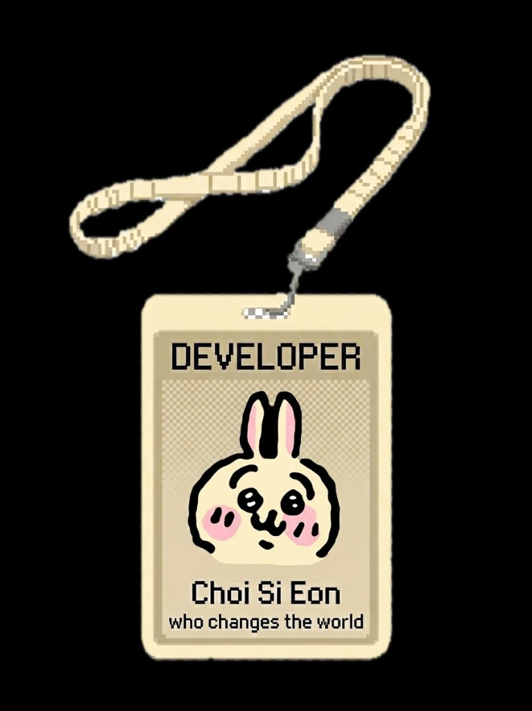
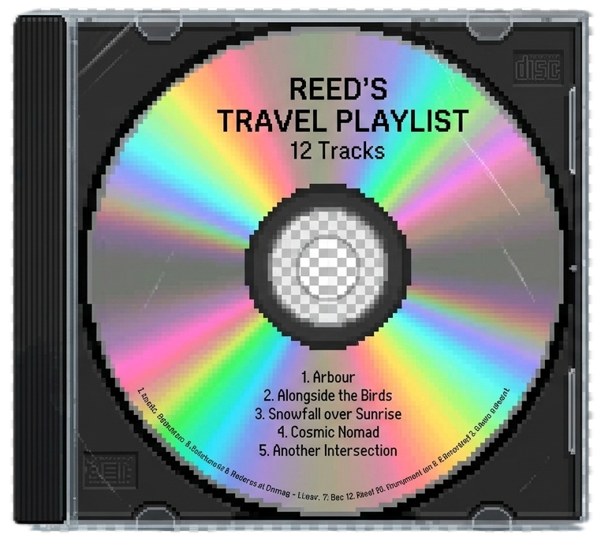
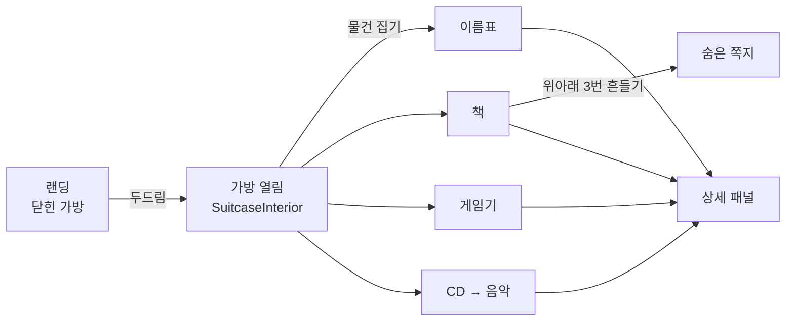

<div align="center">


# 여행가방 포트폴리오 · Suitcase Portfolio

**가방을 두드려, 당신만의 포트폴리오를 여세요.**

닫힌 여행가방을 똑똑 두드리면 스르륵 열리고 —
안에 담긴 이름표 · 책 · 게임기 · CD 를 만지작거리며 한 사람의 이야기를 꺼내 보는
인터랙티브 포트폴리오 서비스입니다.

<br />

[](https://portopolio-box.vercel.app)

<br />


</div>

---

## 이게 뭔가요?

포트폴리오는 대부분 **위에서 아래로 스크롤하는 이력서**입니다.
이 프로젝트는 그걸 **여행가방 하나**로 바꿨습니다.

> 방문자는 가방을 **두드리고**, **열고**, 안에 있는 물건을 **집어 들고**, **흔들고**, **던져 놓으며** 당신을 알아갑니다.
> 각 물건이 곧 포트폴리오의 한 챕터예요.

그리고 이건 나 혼자만의 페이지가 아니라, **누구나 자기 URL(`/내이름`)로 자기 가방을 갖는 멀티테넌트 서비스**입니다.

---

## 가방 안에는 뭐가 있나요?

<table>
  <tr>
    <td align="center" width="20%"></td>
    <td align="center" width="20%"></td>
    <td align="center" width="20%"></td>
    <td align="center" width="20%"></td>
    <td align="center" width="20%"></td>
  </tr>
  <tr>
    <td align="center"><b>이름표</b></td>
    <td align="center"><b>책</b></td>
    <td align="center"><b>게임기</b></td>
    <td align="center"><b>CD</b></td>
    <td align="center"><b>쪽지</b></td>
  </tr>
  <tr>
    <td align="center">프로필 · 연락처</td>
    <td align="center">프로젝트 · 경험</td>
    <td align="center">취미 · 관심사</td>
    <td align="center">플레이리스트</td>
    <td align="center">히든 메시지</td>
  </tr>
</table>

**숨은 재미**

- **책** 을 위아래로 3번 흔들면, 책 사이에서 쪽지가 툭 떨어집니다. (히든 이스터에그)
- **CD** 를 집는 순간 배경 음악 플레이어가 켜집니다.
- 모든 물건은 **드래그해서 아무 데나 놓을 수 있고**, 가방 벽에 부딪히면 툭 소리가 나요.
- 7초 동안 가만히 있으면 이름표가 "나 좀 눌러줘" 하고 꿈틀거립니다. (idle nudge)

---

## 인터랙션 디테일

작은 감각들을 잔뜩 넣었습니다.

- **사운드 레이어** — 두드림(knock) · 열림(open) · 물건 집기(item) · 벽 충돌(bump), 각각 다른 소리
- **포인터 기반 드래그** — 마우스/터치 각각 다른 임계값, 던지면 그 자리에 남고 세션에 저장
- **책 흔들기 제스처** — 위/아래 방향 전환 3회를 감지해 쪽지 드롭 (물리 스프링 애니메이션)
- **z-index 브링 투 프론트** — 마지막에 만진 물건이 항상 맨 위로
- **키보드 접근성** — 모든 물건을 `Tab` → `Enter/Space` 로 열 수 있고 `aria-label` 완비
- **`prefers-reduced-motion` 존중** — 애니메이션 민감 사용자는 정적 모드로 폴백
- **History API 연동** — 브라우저 뒤로가기로 상세 패널/편집창을 자연스럽게 닫고, 저장 안 한 변경은 경고

---

## 기술 스택

| 영역 | 사용 기술 |
|:---|:---|
| **프론트엔드** | React 19 · TypeScript 5.9 · Vite 8 |
| **스타일** | Tailwind CSS 4 (`@tailwindcss/vite`) |
| **애니메이션** | Framer Motion 12 |
| **라우팅** | React Router 7 (멀티테넌트 `/:slug`) |
| **백엔드 / 인증 / DB** | Supabase (Auth · Postgres · Edge Functions · Storage · RLS) |
| **결제** | Toss Payments SDK |
| **기타** | QRCode 생성, 소셜 로그인, 7개국어 i18n |
| **배포** | Vercel (SPA rewrite) |

---

## 다국어 (i18n)

버튼 하나로 **7개 언어**를 지원합니다. UI 문구와 포트폴리오 콘텐츠가 모두 번역돼요.

한국어 · English · 日本語 · 中文 · Deutsch · Español · Français

> 편집 화면에는 **AI 번역 가이드 + 프롬프트 템플릿**이 내장돼 있어, 자기 포트폴리오를 손쉽게 다국어화할 수 있습니다.

---

## 서비스 구조 (SaaS)

혼자 쓰는 페이지가 아니라, **누구나 자기 가방을 갖는 서비스**로 설계했습니다.

```
방문   →  /:slug 로 각자의 포트폴리오 가방 열람
가입   →  소셜 로그인 (Supabase Auth)
온보딩 →  slug(내 URL) 선택 + 초기 세팅
결제   →  Toss Payments (월간 / 연간 / 영구)
편집   →  인라인 편집 패널 · 이모지 · 아이템 위치/노출 커스터마이징
```

**요금제**

| 플랜 | 가격 | 특징 |
|:---|:---|:---|
| Monthly | ₩4,900 / 월 | 커스텀 URL · 편집 · 다국어 |
| **Yearly** | ₩39,000 / 년 | 월간 대비 **34% 절약** · 우선 지원 |
| Permanent | ₩99,000 (1회) | 평생 이용 |

> 결제 확정과 계정 삭제는 **Supabase Edge Functions**(`confirm-payment`, `delete-account`)에서 서버 사이드로 처리합니다.

---

## 프로젝트 구조

```
portopolio_box/
├─ src/
│  ├─ pages/            # 라우트: Portfolio · Login · Signup · Pricing · Onboarding · AuthCallback
│  ├─ components/
│  │  ├─ Landing.tsx           # 두드리는 닫힌 가방
│  │  ├─ SuitcaseInterior.tsx  # 드래그·흔들기 등 핵심 인터랙션 무대
│  │  ├─ DetailPanel.tsx       # 물건 상세 패널
│  │  ├─ MusicPlayer.tsx       # CD 플레이어
│  │  ├─ details/       # 물건별 상세: Nametag · Book · CD · Switch
│  │  └─ edit/          # 편집 패널 · 번역 모달 · 이모지 입력
│  ├─ assets/           # 직접 만든 SVG 물건 컴포넌트 + 이미지 + 사운드
│  ├─ hooks/            # useKnockSound · useBumpSound · useOpenSound · useItemSounds · useReducedMotion …
│  ├─ contexts/         # Auth · Portfolio
│  ├─ i18n/             # 7개국어 UI/콘텐츠 사전
│  └─ lib/              # supabase · portfolio · markdown · cache
├─ supabase/
│  ├─ migrations/       # 001_init … 007_add_side_projects
│  ├─ functions/        # confirm-payment · delete-account (Edge Functions)
│  └─ seed.sql
└─ public/              # 파비콘 · OG 이미지
```

---

## 시작하기

```bash
# 1) 의존성 설치
npm install

# 2) 환경 변수 설정 (.env.local)
#    아래 키를 직접 채워주세요

# 3) 개발 서버
npm run dev        # http://localhost:5173

# 4) 프로덕션 빌드 / 미리보기
npm run build
npm run preview

# 5) 린트
npm run lint
```

**필요한 환경 변수**

```dotenv
VITE_SUPABASE_URL=       # Supabase 프로젝트 URL
VITE_SUPABASE_ANON_KEY=  # Supabase anon 키
VITE_TOSS_CLIENT_KEY=    # Toss Payments 클라이언트 키
```

**Supabase 준비**

```bash
supabase db push          # migrations 적용 (001 ~ 007)
supabase db seed          # seed.sql 로 초기 데이터
supabase functions deploy confirm-payment
supabase functions deploy delete-account
```

---

## 동작 흐름 한눈에



---

## 특징 요약

- **컨셉이 곧 UX** — 이력서가 아니라 '열어보는 물건들'
- **디테일 폭격** — 사운드 · 물리 · idle 넛지 · 히든 이스터에그
- **접근성 기본기** — 키보드 · aria · reduced-motion
- **7개국어** + AI 번역 가이드 내장
- **완결된 SaaS** — 인증 · 결제 · 멀티테넌트 · 계정 삭제
- **최신 스택** — React 19 / Vite 8 / Tailwind 4 / Supabase

---

<div align="center">

*이 프로젝트는 기획부터 개발·배포까지 Claude Opus 와 함께 만들어졌습니다.*

**[지금 열어보기 →](https://portopolio-box.vercel.app)**

</div>
